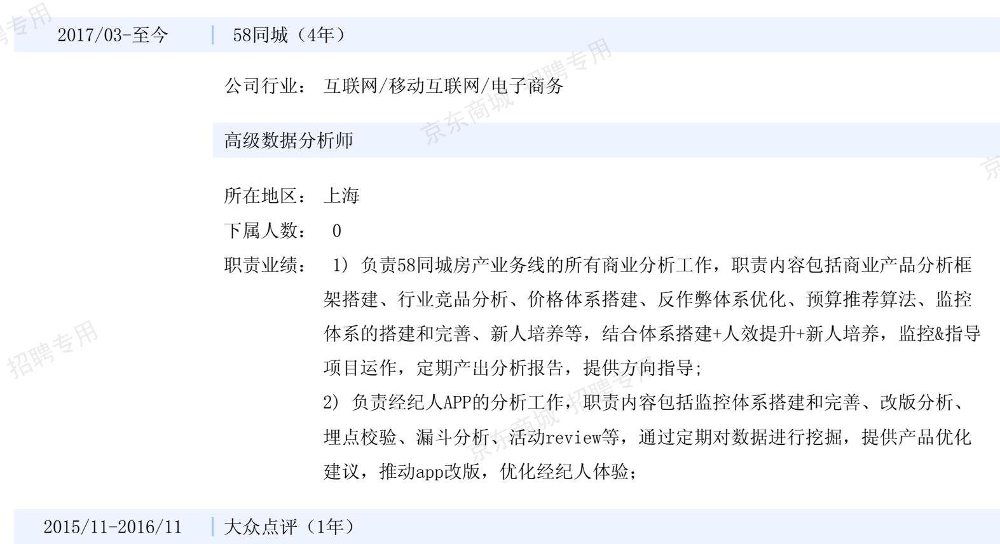
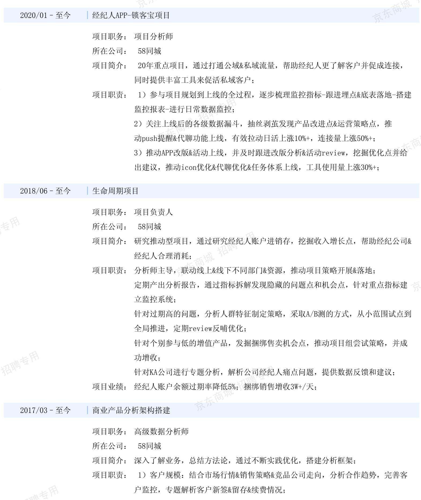

## 个人信息

姓名：康\*\*

年龄：29岁

性别：女

教育程度：硕士

工作年限：4年

所在地：上海

当前概况：在职，暂无跳槽打算

## 目前职业概况

所在行业：互联网/移动互联网/电子商务 公司名称：58同城

所任职位：高级数据分析师

目前年薪：保密

## 职业发展意向

期望行业：互联网/移动互联网/电子商务;基金/证券/期货/投资;银行

期望职位：数据分析师

期望地点：上海

期望年薪：36.00万-60.00万（30K/月-50K/月\*12薪）

## 工作经历

公司行业：互联网/移动互联网/电子商务

数据分析师实习生

所在地区：上海  
下属人数：  
职责业绩：1）负责用户端的流量数据分析，支持频道引流、用户留存、效果数据监控和产品更新；2）分析商户端数据，支持市场部产品定价、销售策略和行业决策；

## 项目经历

2）变现方式：通过各类增值产品实现流量变现，搭建产品定价调价模型、预算推荐模型，完善指标监控体系，定期分析收入趋势；开创生命周期项目，深度分析客户消耗习惯&账户过期情况，挖掘收入增长点；

3）客户效果：定期跑门店，总结客户诉求，推动流量质量监控，制定流量分配策略，帮助经纪人快速有效获客；优化反作弊体系、客诉流程提升客户体验；推进商业流量占比&收入占比的持衡，降低经纪人获客成本；

2018/01-2019/07精选项目

项目职务：高级数据分析师

所在公司：58同城

项目简介：商业变现类项目，通过cpc产品为房产经纪人提供高速获客的渠道，达到网站与b端双赢的目的；  
项目职责：深入了解业务，打破单线分析的方式，同时结合流量变现和参与意愿构建新分析框架，发现表象数据隐藏的问题：分析网站流量分布，挖掘流量增长点，保质保量实现站内引流；通过趋势分析的方法进行收入预测，指标拆解进行收入涨降分析，给项目组提供方向指导； 东商城构建价格模型，通过小步快跑的方式尝试不同定价模型，对比效果优化策略，维京东持收入与客户之间的平衡；优化反作弊系统，新增10条以上新策略，提升客户体验度&客户对网站的信赖度；  
项目业绩：动精选收入年环比上涨10%+；

## 教育经历

东华大学2014/09-2017/03

东华大学2011/09-2014/07

专业：数学与应用数学

学历：硕士

专业：金融学

东华大学2010/09-2014/07

专业：统计学

学历：本科

学历：本科

## 语言能力

普通话、英语(CET6)

## 自我评价

认真仔细，有责任心，对新事物有好奇心，喜欢研究。

## 附加信息

2020.06部门优秀员工、集团优秀团队成员2017.12 部门优秀员工奖2015.11获得2015年SAS大赛初赛优秀队伍奖

2014.09获得东华大学硕士研究生学业奖学金（一等）

2012.09获得东华大学学生年度人物十大人物提名奖

声明：该人选信息仅供公司招聘使用，严禁以招聘以外的任何目的使用人选信息或利用猎聘平台及人选信息从事任何违法违规活动。否则，猎聘有权单方决定采取包括但不限于删除发布内容，限制、暂停使用，终止合作永久封禁账户等措施。

操作时间：2021.03.2819:12:24操作人：91341693